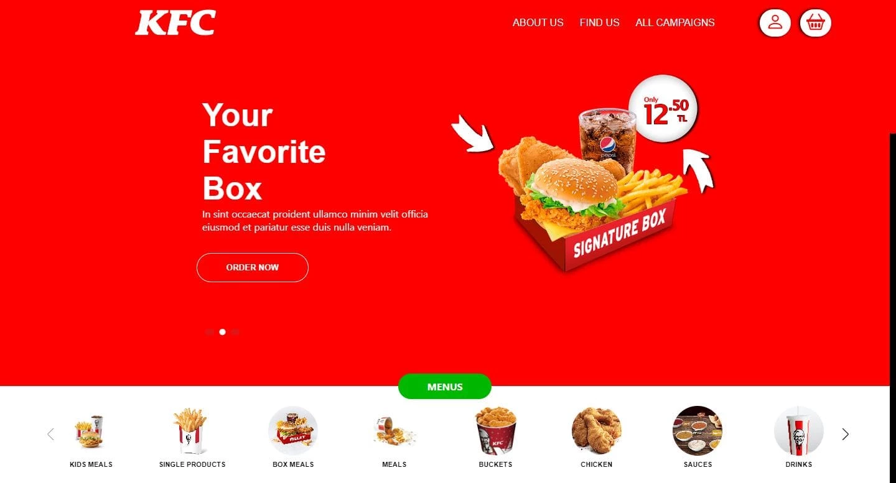
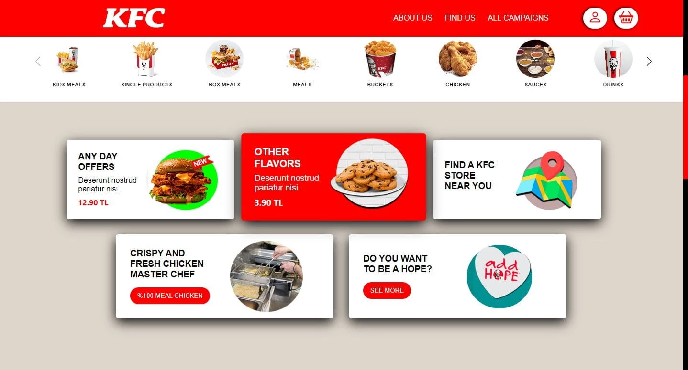
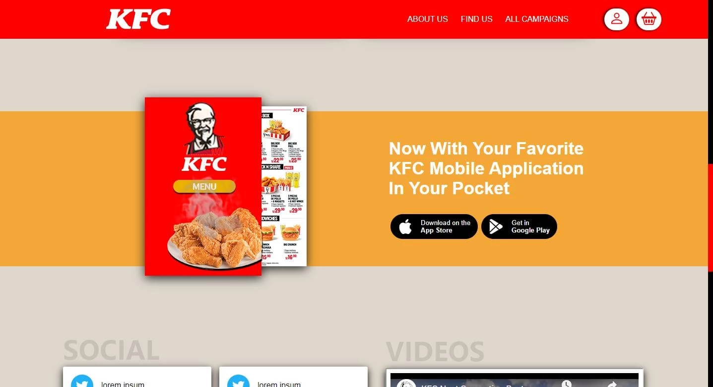
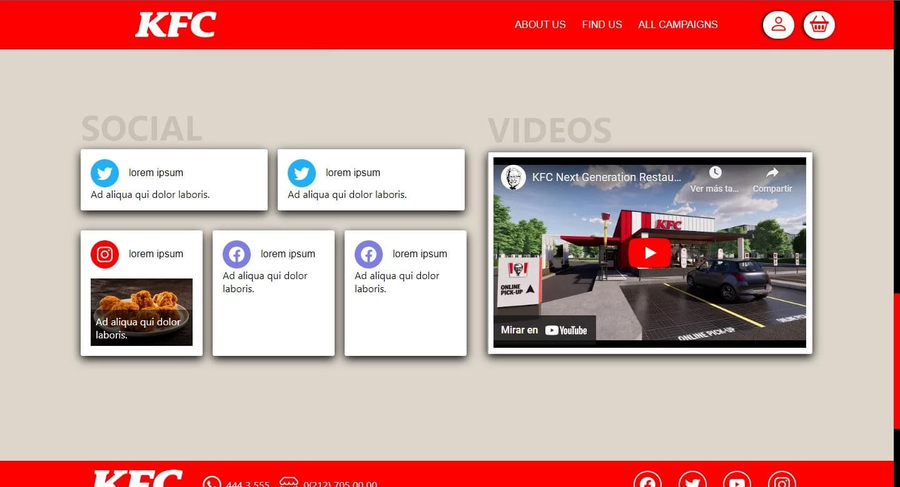
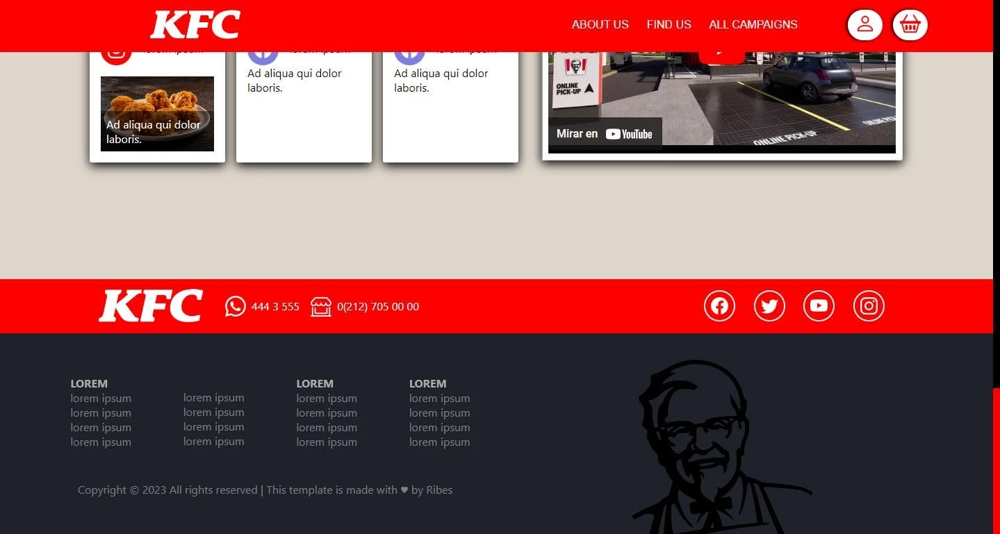

## Table of Contents
1. [General Info](#general-info)
2. [Technologies](#technologies)
3. [Installation](#installation)
3. [Screenshots](#Screenshots)
4. [Deploy](https://kfc-template.vercel.app/)

### General Info
***

It is a template of one of the fast food chains, kfc. I did it to demonstrate what I can design from an image of a web page.

Es una plantilla de una de las cadenas de comida rapida, kfc. La realice para demostrar lo que puedo diseñar a partir de una imagen de una pagina web.

## Technologies
***
A list of technologies used within the project:
* React: Version 18.2.0
* SCSS: Version 1.63.3

## Installation
***
A little intro about the installation. 
```
$ git clone https://github.com/rodri-ribes/kfc-template.git

$ npm install
$ npm start
```
### Screenshots
***





***
